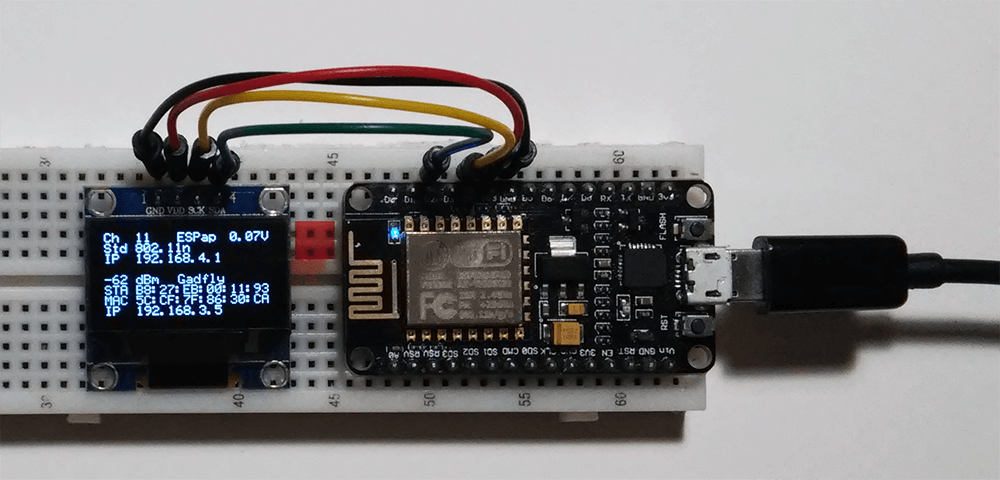
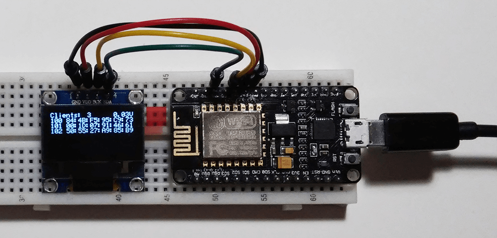
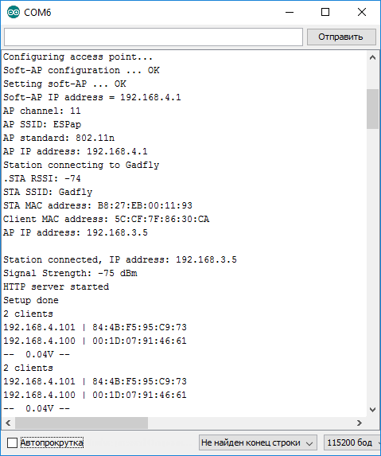
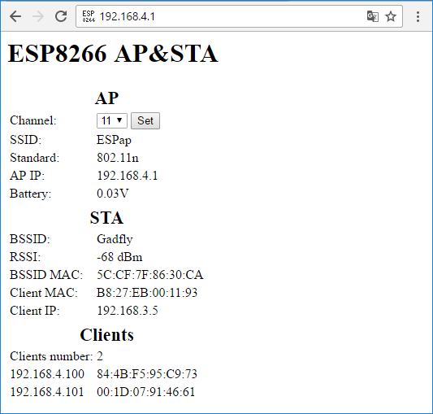
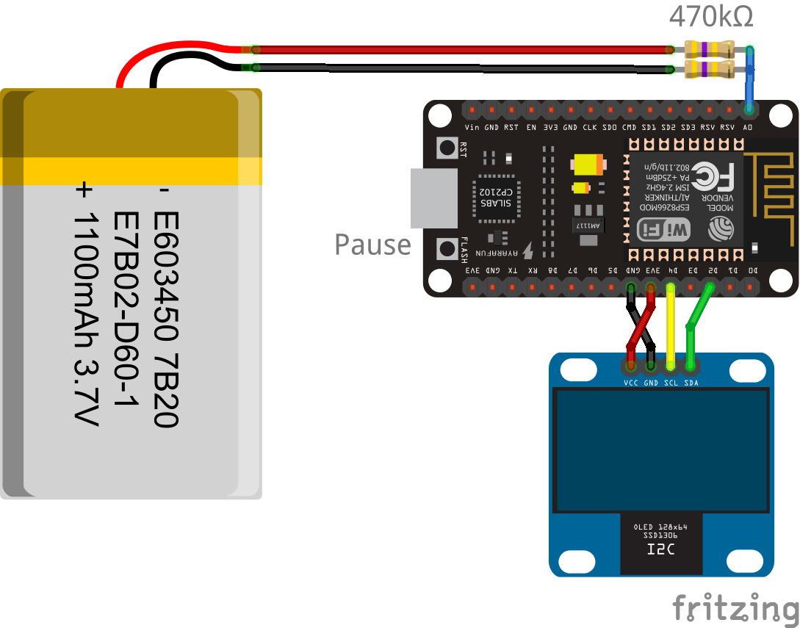
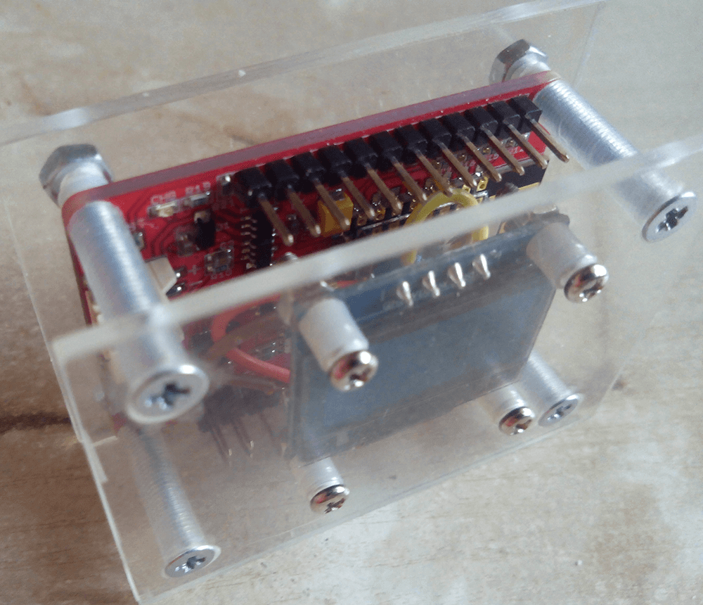

# ESP8266_oled_AP_ssd1306

The repeater can be used to build or test the stability of wireless IOT systems. The repeater connects to the access point, the parameters of which are set in advance. If the connection fails, only the local network is deployed.

When you download, the connection settings are displayed. If you want to view them again, click the Flash button for the NodeMCU (and its clones) or close the GPIO0 (D3).

You can view the data through a virtual COM port.

Also, based on the repeater, a web interface is deployed, which is accessible from external and internal networks and allows viewing current information and changing the channel number. The page is automatically updated every half a minute.

## Equipment

1. ESP8266 (NodeMCU v1.0)
2. OLED 0.96" 128×64 I2C SSD1306

## Display

Connect OLED to ESP8266 as shown on the picture.

For ESP-cards with battery support, for example, from [Elecrow](https://www.elecrow.com/wiki/index.php?title=ESP8266_IOT_Board(Arduino_IDE_or_NodeMCU_Lua_Programming)), a voltage meter on the battery is added through the voltage divider. When the voltage is less than 3V, the module goes into sleep mode, you can overload it from this mode.

## ESP8266

Install [ESP8266](http://esp8266.ru/arduino-ide-esp8266/#fast-start) (Russian) libraries in Arduino IDE.

## Connection Map

| NodeMCU    | OLED  |
| ---------- | ----- |
| D2 (GPIO4) | SDA   |
| D4 (GPIO2) | SCL   |
| 3V3        | VCC   |
| GND        | GND   |

## Implementation

The prototype is made in acrylic case with the ability to connect the battery.

