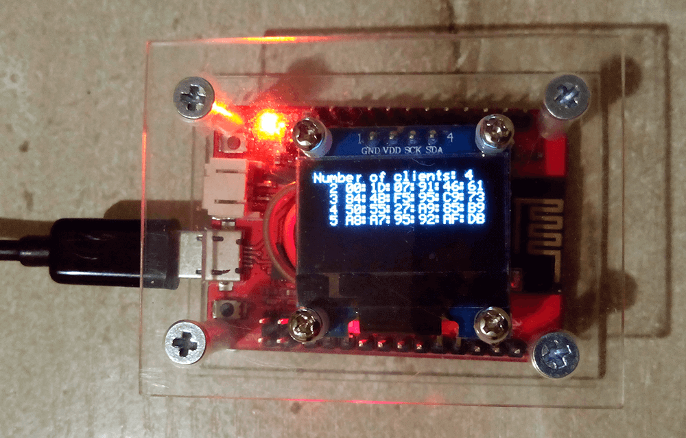

There is a collection of projects for IoT.

# ESP8266_oled_AP_ssd1306

An example of AP on [_ESP8266_ module with I2C _OLED SSD1306_](./Wixel/ESP8266_oled_AP_ssd1306) and battery.

# Adafruit_Python_SSD1306

An access point (AP) on Raspberry Pi 3 (RPi) with OLED display (SSD1306 128x64 I2C or SPI).

https://github.com/Oestoidea/Adafruit_Python_SSD1306

# Author

Vladimir Sokolov aka Oestoidea

# Licenses

The source code are licensed under the [GNU GPLv3](https://www.gnu.org/licenses/gpl-3.0.html).
The schematics are licensed under the [CC-BY-SA 3.0](http://creativecommons.org/licenses/by-sa/3.0/).
